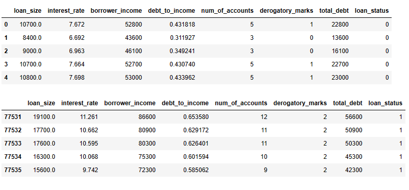
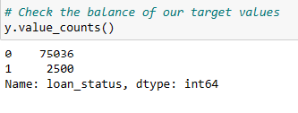
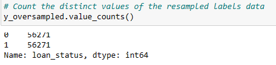
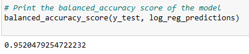
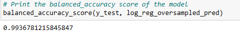
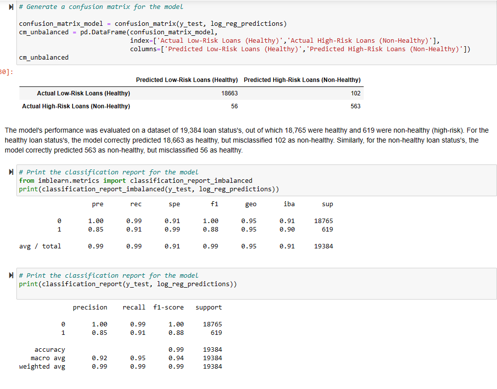
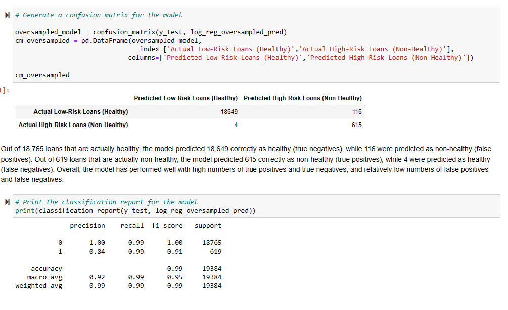

# credit-risk-classification

## Overview of the Analysis

The purpose of the analysis is to build a model that can identify the creditworthiness of borrowers.

Specifically, to develop a mathematical model or algorithm that can predict whether a borrower is likely to repay a loan or not, or to measure of how likely a borrower is to pay back a loan. This measure will help to determine if the lending company or lender should lend money to the borrower and if so, how much and at what interest rate, etc., as shows below:

To build this model, data related to borrowers were used (lending_data.csv), such as their loan_size, interest_rate, borrower_income, debt_to_income, num_of_accounts, derogatory_marks, total_debt and loan_status.Then, run a simple implementation of a logistic regression model for binary classification for model, RandomOverSampler to resample the data and evaluates its performance using a balanced accuracy score and a confusion matrix. Two models were built, the first one is the model with unbalanced samples and the other one that used RandomOverSampler to resample the data for balanced samples.
(Assuming that the data are cleaned, preprocessed, and transformed into a format that can be used to train a machine learning model)

Unbalanced

Oversampled

The goal of the models is to accurately predict the creditworthiness of new borrowers who are not included in the training data so lenders can make informed decisions about whether to approve or deny loan applications. A good creditworthiness model should have a high degree of accuracy and be able to identify potential loan defaults early, reducing the risk of financial losses for the lender.
See the difference:

Unbalanced

Oversampled

## Results

* Machine Learning Model 1: Unbalanced Samples
  * Description of Model 1 Accuracy, Precision, and Recall scores.

* Machine Learning Model 2:Oversampled Data
  * Description of Model 2 Accuracy, Precision, and Recall scores.

## Summary

* The oversampled model produced an accuracy score of 99%, which is higher than the model trained on unbalanced data. The improved performance of the oversampled model is attributed to its superior ability to detect errors, such as misclassifying non-healthy (high-risk) loans as healthy (low-risk). This is evident from the higher recall score of the oversampled model, which increased from 0.91 to 0.99 compared to the unbalanced model.

* A lending company may prefer a model with a higher recall score because misclassifying non-healthy loans as healthy could have a more significant financial impact on the company. While misclassifying healthy loans as non-healthy may result in the loss of customers, it would not directly result in a monetary loss for the lender as they have not yet provided funds to the customer. In contrast, misclassifying non-healthy loans as healthy could result in the loss of funds provided by the lender, which would be more costly for the lending company.

